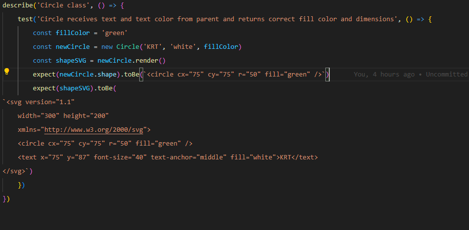
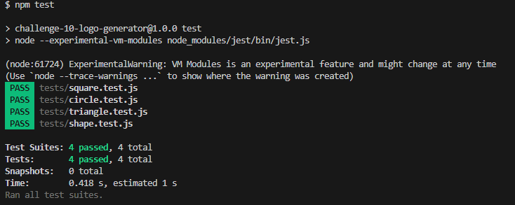

# 10-logo-generator

## Description

This is a project for UW in which we were asked to create a logo generator. Using Node.js and the Inquirer package, the user is prompted for up to three characters of text and the color of that text. They are then given the choice between a circle, square or triangle and the color they would like the shape to be. A logo.svg file is then generated based on the user responses and stored in the /examples folder.

## Installation

Pull the contents of this repo into a local directory. Navigate to the directory and type 'npm install' into the command line.

## Usage

Type 'node index.js' into the command line to run the program. It will ask you a series of questions and then generate a logo.svg file based on your answers. The logo will be stored in the /examples folder to be renamed or moved.

Link to video of app in use: https://drive.google.com/file/d/1n6AD1WtwOQhrjRDaZMSEC2EHyRjVpJMX/view

## License

N/A

## Tests

Tests were written and run using the Jest npm package. The Shape class was tested for its functionality in taking in and storing text and text color. Each Shape child class (Circle, Square, Triangle) was tested for its functionality in inheriting text and color from the parent class, as well as taking in a the shape and fill color, then generating the corresponding `<svg>` element.

Shape class test

Circle class test

CLI Jest results

## Questions

Any questions about this application should be directed to:

GitHub: https://github.com/ktunebe

Email: ktunebe@gmail.com
